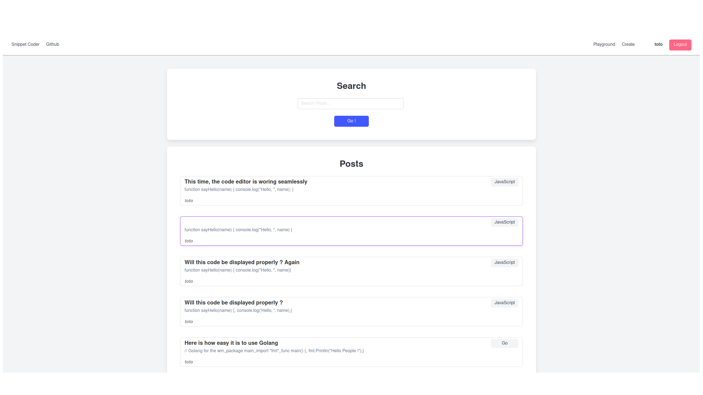
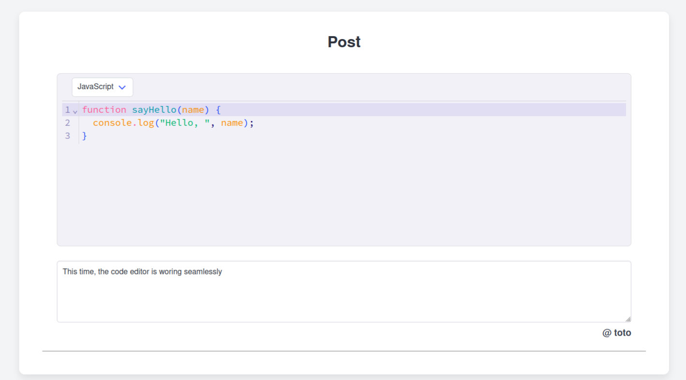

# Online Code Platform

## Introduction

This web application is an advance web editor and a QA site for developers. It has 2 mains purposes.
First, programmers can post and receive answers their coding problem
Second, programmers can do live programming with the integrated web editor






## Roadmap

- [x] User Login and integration with 'posts' table (DB)
- [x] Fronted Styling
- [x] Remove backup files from 'src/post/' and 'src/new/'
- [ ] ~~Replace 'codemirror' by 'highlight.js' for read only post (better user experience)~~
- [ ] LSP integration (LSP server on backend and [LSP client on fronted](https://github.com/furqansoftware/codemirror-languageserver]))
- [x] Allow user to change server behavior through config file (toml), eg. changing the root of the file directory (for now it is '../dist/')
- [ ] Playground editor that will send the code to server for compilation, and server respond with compilation result
- [x] Live coding collaboraition (pair programming)(eg. multi user edit in Google Doc)
- [ ] File system or code space eg. give root directory to user so that they can create files and folders themselves as if they where on the own file system (github workspace)
- [ ] Multi-files code editor similar to [svelte tutorial](https://learn.svelte.dev/tutorial/media-elements). Luckily enough, the [source code](https://github.com/sveltejs/learn.svelte.dev) is available.
- [ ] Show comment count for a post on the list of post available
- [ ] Make WebSocket work on render.com by securing the communication with TLS

## How to contribute

The development process of this project is quite cumbersome, enough to warrant this section.
First, the application is server side rendered (SSR), and there is no API endpoints.
Therefore, there is a minimal use of JS

However, the code editor from the library codemirror require the use of JS to manipulate the DOM
Thus, I used Vite JS as a build tool (bundler).
As a consequence, the server written in Go cannot directly interact with the html, css, js code.
Since Vite JS will transpile first the frontend source to '../dist/' folder, the server instead serve assets from that location
This create a nasty pipeline !

**Every modification to HTML, CSS, or JS files must first be compiled by Vite JS**. Otherwise the server will not be aware of new modification.

Another issue is that I was unable to seamlessly configure Vite JS to automatically compile all file types.
I enabled a watch options that automatically compile '.html' and '.js' file upon change (Vite JS must be run first through 'npm run build', look 'package.json' and 'vite.config.js' to learn more)
However, I always had error while trying to compile '.css' and '.tmpl' file (automatically or not). That's why they are in the 'public' folder, as Vite JS just copy those files over without any modification (read the Vite config file for more details).

In summary,

```bash
# Each terminal start from the root directory of the project
# 1. In one terminal (Frontend Compilation)
npm run build

# 2. On the second terminal (Backend Compilation)
cd backend/
air
```

**Note**: Turn out the solution was to use `makefile`. I tested it recently, and it is quite promising to solve the 'compilation' issue with just one command, instead of typing many commands
It is quite the nice task runner !

## Post Mortem 
